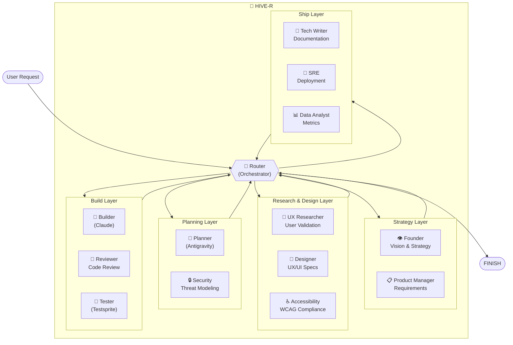

# HIVE-R Architecture

> A hive of 13 world-class AI agents for product development.

## Overview

HIVE-R is an orchestrated multi-agent system built on **LangGraph** and **Hono**. A central **Router** (Orchestrator) analyzes each request and delegates to the appropriate specialist agent. Agents pass results back to the Router, which decides the next step until the task is complete.

## System Diagram



## Agent Reference

| # | Agent | Persona | Responsibility |
|---|-------|---------|----------------|
| 1 | **Founder** | The Visionary | Strategic direction, "Why build this?" |
| 2 | **ProductManager** | Senior Staff PM | PRDs, user stories, requirements |
| 3 | **UXResearcher** | Staff UX Researcher | User validation, research synthesis |
| 4 | **Designer** | Staff Product Designer | UX/UI specifications, design systems |
| 5 | **Accessibility** | A11y Expert | WCAG compliance, inclusive design |
| 6 | **Planner** | Antigravity | Technical architecture, implementation plans |
| 7 | **Security** | Staff Security Engineer | Threat modeling, security review |
| 8 | **Builder** | Claude | Code implementation |
| 9 | **Reviewer** | Distinguished Developer | Code review, quality gates |
| 10 | **Tester** | Testsprite | QA, test strategy, bug identification |
| 11 | **TechWriter** | Staff Tech Writer | API docs, guides, documentation |
| 12 | **SRE** | Staff SRE | Deployment, reliability, observability |
| 13 | **DataAnalyst** | Staff Data Analyst | Metrics, analytics, insights |

## Typical Flow

```
User Request
    │
    ▼
┌─────────┐
│ Router  │ ─────► Decides: "This needs strategic validation"
└────┬────┘
     │
     ▼
┌─────────┐
│ Founder │ ─────► "Yes, this aligns with our vision. Proceed."
└────┬────┘
     │
     ▼
┌─────────┐
│ Router  │ ─────► Decides: "Now define requirements"
└────┬────┘
     │
     ▼
   ... (flows through relevant agents) ...
     │
     ▼
┌─────────┐
│ Router  │ ─────► Decides: "FINISH"
└─────────┘
```

## File Structure

```
src/
├── index.ts              # Hono server + LangGraph wiring
├── agents/
│   ├── router.ts         # Orchestrator
│   ├── founder.ts
│   ├── product-manager.ts
│   ├── ux-researcher.ts
│   ├── designer.ts
│   ├── accessibility.ts
│   ├── planner.ts
│   ├── security.ts
│   ├── builder.ts
│   ├── reviewer.ts
│   ├── tester.ts
│   ├── tech-writer.ts
│   ├── sre.ts
│   └── data-analyst.ts
├── lib/
│   ├── state.ts          # Shared AgentState
│   ├── utils.ts          # Helper functions
│   └── memory.ts         # Checkpointer
└── tools/
    └── database.ts       # Shared tools
```

## API

### `POST /chat`
Send a message to the hive.

```bash
curl -X POST http://localhost:3000/chat \
  -H "Content-Type: application/json" \
  -d '{"message": "Design a user dashboard for analytics"}'
```

### `GET /agents`
List all available agents.

```bash
curl http://localhost:3000/agents
```

## Running

```bash
# Development (hot reload)
npm run dev

# Production
npm start
```

## Key Concepts

### Router (Orchestrator)
The Router is the "brain" of HIVE-R. It uses GPT-4o with structured output to decide which agent should act next. It considers the conversation history and the natural product development workflow.

### State
All agents share a common state (`AgentState`) containing:
- `messages`: The conversation history
- `next`: The next agent to route to

### Workflow Layers
Agents are conceptually grouped into layers:
1. **Strategy**: Founder, PM
2. **Research & Design**: UX Researcher, Designer, Accessibility
3. **Planning**: Planner, Security
4. **Build**: Builder, Reviewer, Tester
5. **Ship**: Tech Writer, SRE, Data Analyst
